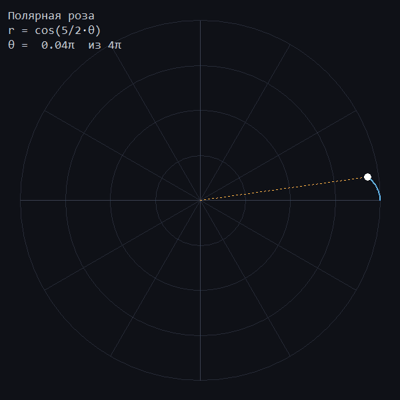
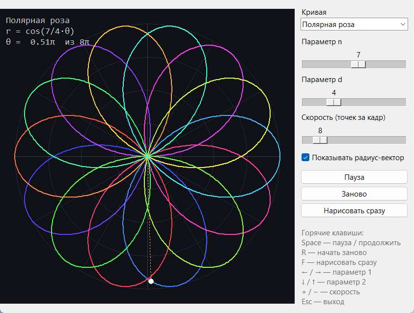
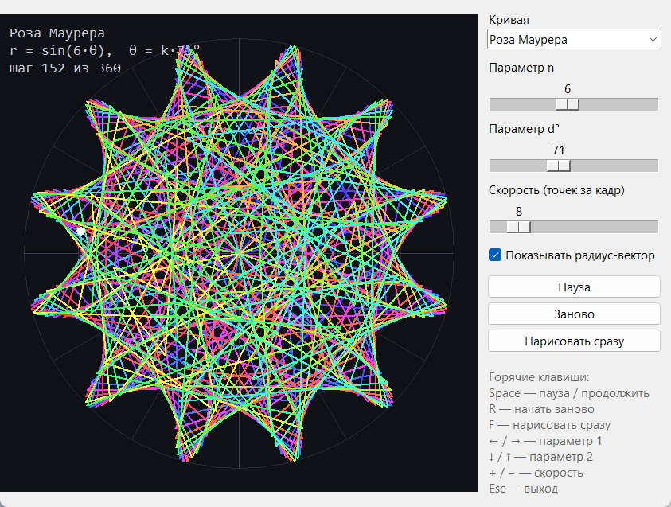
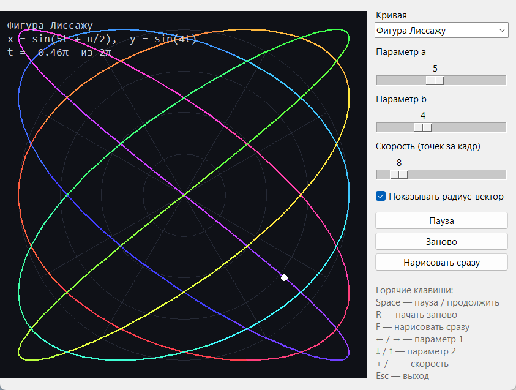
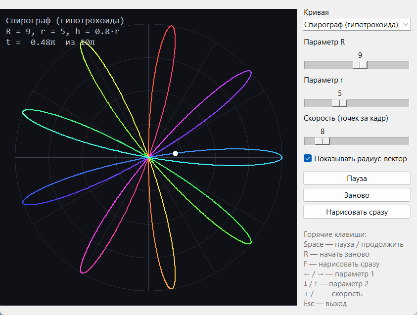

# Полярная роза

**Автор:** Тасоев Арсен
**Группа:** ПИ25-1
**Дисциплина:** _указать_
**Дата сдачи:** __.__.2026

## Описание проекта

Программа на `tkinter` анимированно рисует полярную розу
`r = cos(n/d · θ)`: кривая постепенно появляется на экране, а точка с
радиус-вектором показывает, как полярный радиус меняется вместе с углом.
Параметры `n` и `d` регулируются слайдерами, и рисунок сразу перестраивается.
Кроме розы в программе есть другие параметрические кривые: роза Маурера,
фигуры Лиссажу и спирограф.

## Функциональные возможности

### Основной функционал (задание «Полярная роза»)
- 🌸 Отрисовка полярной розы `r = cos(k·θ)`, где `k = n / d`
- 🎞️ Анимация: кривая рисуется постепенно, курсор с радиус-вектором бежит по ней
- 🔁 Точный расчёт периода: роза замыкается за `π·d` или `2π·d`
- 🌈 Градиентная раскраска кривой и полярная сетка
- 🔢 Подсказка на экране: формула, число лепестков, текущий угол θ

### Дополнительный функционал
- 🎚️ **Доп. задание 1:** параметры `n` и `d` меняются слайдерами (и стрелками)
- 📐 **Доп. задание 2:** другие параметрические кривые:
  - роза Маурера: `r = sin(n·θ)`, вершины через `d°`
  - фигуры Лиссажу: `x = sin(a·t + π/2)`, `y = sin(b·t)`
  - спирограф (гипотрохоида) с радиусами `R` и `r`
- ⏯️ Пауза, перезапуск и мгновенная отрисовка
- ⚡ Регулировка скорости анимации
- ⌨️ Горячие клавиши (работают и в русской раскладке)
- ✅ Модульные тесты математической модели (13 тестов)

## Демонстрация работы программы

### Анимация (n = 5, d = 2)


### Полярная роза n = 7, d = 4


### Роза Маурера n = 6, d = 71°


### Фигура Лиссажу a = 5, b = 4


### Спирограф R = 9, r = 5


## Математика

Полярная роза в полярных координатах: `r(θ) = cos(k·θ)`, `k = n / d`.
Для отрисовки точка переводится в декартовы координаты:

```
x = r(θ) · cos θ
y = r(θ) · sin θ
```

**Период.** Пусть дробь `n/d` несократима. Если `n` и `d` оба нечётные,
то `cos(k·(θ + π·d)) = cos(k·θ + π·n) = −cos(k·θ)`. Точка с отрицательным
радиусом совпадает с исходной, поэтому роза замыкается за `π·d`.
В остальных случаях период равен `2π·d`.

**Число лепестков** при целом `k`: `k` для нечётного `k` и `2k` для чётного.

**Масштаб.** Модель возвращает координаты в квадрате `[-1; 1]`, а рендерер
переводит их в пиксели. Ось Y на экране направлена вниз, поэтому `y`
берётся с минусом.

## Требования к системе

- **Python:** 3.9 или выше
- **Операционная система:** Windows / macOS / Linux
- **Библиотеки:** только стандартные: `tkinter` (встроенная), `math`,
  `colorsys`, `abc`, `unittest`. Внешних зависимостей нет.

> На Linux `tkinter` иногда ставится отдельно: `sudo apt install python3-tk`.

## Установка и запуск

### 1. Клонирование репозитория
```bash
git clone https://github.com/USERNAME/polar-rose.git
cd polar-rose
```

### 2. Создание и активация виртуального окружения
Папка `venv/` лежит в репозитории (так требует задание). На другом
компьютере окружение лучше создать заново.

Windows:
```bash
python -m venv venv
venv\Scripts\activate
```

macOS/Linux:
```bash
python3 -m venv venv
source venv/bin/activate
```

### 3. Установка зависимостей
```bash
pip install -r requirements.txt
```
Внешних библиотек нет, поэтому команда ничего не установит.

### 4. Запуск программы
```bash
python main.py
```

### 5. Управление

| Действие | Клавиша / элемент |
|---|---|
| Пауза / продолжить | `Space` или кнопка «Пауза» |
| Начать заново | `R` или кнопка «Заново» |
| Нарисовать сразу | `F` или кнопка «Нарисовать сразу» |
| Параметр 1 (`n`, `a`, `R`) | `←` / `→` или первый слайдер |
| Параметр 2 (`d`, `b`, `r`) | `↓` / `↑` или второй слайдер |
| Скорость | `+` / `−` или слайдер скорости |
| Выбор кривой | выпадающий список «Кривая» |
| Радиус-вектор | флажок «Показывать радиус-вектор» |
| Выход | `Esc` |

### 6. Запуск тестов
```bash
python -m unittest discover tests
```

## Структура проекта

```
polar-rose/
├── .gitignore                  # __pycache__, *.pyc, настройки IDE
├── README.md                   # описание и инструкция запуска
├── requirements.txt            # зависимости (только стандартная библиотека)
├── main.py                     # точка входа
├── venv/                       # виртуальное окружение
├── screenshots/                # скриншоты и GIF для README
├── src/
│   ├── __init__.py
│   ├── app.py                  # класс App: окно, цикл анимации, клавиши
│   ├── models/
│   │   ├── __init__.py
│   │   └── animation_model.py  # кривые: PolarRose, MaurerRose, Lissajous, Hypotrochoid
│   ├── renderers/
│   │   ├── __init__.py
│   │   └── renderer.py         # класс Renderer: сетка, кривая, курсор, подпись
│   └── widgets/
│       ├── __init__.py
│       └── controls.py         # класс ControlPanel: слайдеры, кнопки, список
└── tests/
    ├── __init__.py
    └── test_model.py           # тесты математики кривых
```

**Почему такая структура.** Проект разделён на модель, отрисовку и
интерфейс (по идее MVC):

- `models/animation_model.py` — чистая математика без `tkinter`. Её легко
  тестировать, а новая кривая добавляется одним классом-наследником `Curve`
  и строкой в списке `CURVES`.
- `renderers/renderer.py` знает только, как нарисовать точки на `Canvas`,
  и не зависит от того, какая это кривая.
- `widgets/controls.py` — панель управления. Она не содержит логики и лишь
  вызывает переданные ей обработчики.
- `app.py` связывает всё вместе и хранит состояние анимации.
- `main.py` — короткая точка входа.

## Пример использования

1. Запустите `python main.py`. Начнёт рисоваться роза `r = cos(4θ)`
   с 8 лепестками.
2. Сдвиньте слайдер `d` на 3: получится роза `cos(4/3·θ)`, и она замкнётся
   только за `6π`.
3. Нажмите `F`, чтобы сразу увидеть всю фигуру, или `Space`, чтобы
   остановить курсор.
4. В списке «Кривая» выберите «Роза Маурера» и подвигайте слайдер `d°`.

## История коммитов

1. `Тасоев Арсен` — README.md
2. Структура проекта
3. Базовое окно
4. Модель данных
5. Отрисовка базовых объектов
6. Анимация
7. Интерактивность
8. Дополнительный функционал
9. Тесты
10. Документация
